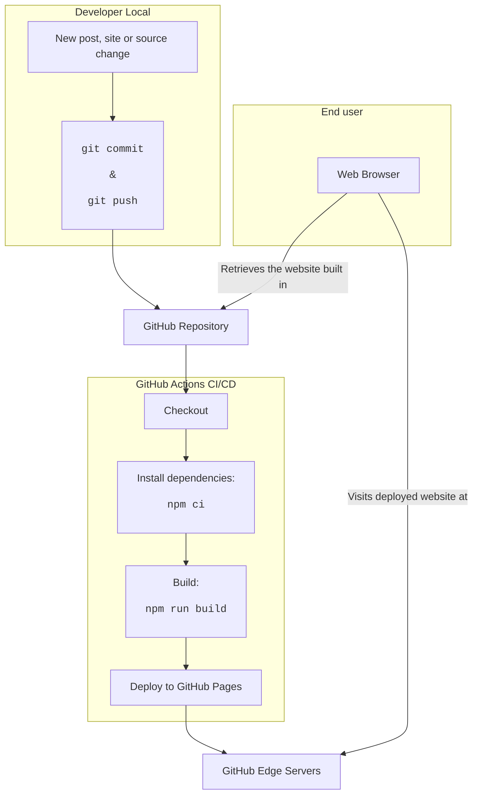

<!-- BEGIN_DOCS -->
<div align="center">

<a name="readme-top"></a>

**Tech Blog**


Nesse repositório, organizo a estrutura do meu blog pessoal

[](https://www.conventionalcommits.org/en/v1.0.0/) [](https://semantic-release.gitbook.io/semantic-release/usage/configuration) [](https://jetpack.io/devbox/docs/contributor-quickstart/)

</div>

# Sumário

- [Visão Geral](#visão-geral)
- [Estrutura de Pastas](#estrutura-de-pastas)
- [Comandos](#comandos)
- [Features](#features)
- [Pipeline Process](#pipeline-process)
- [Referências](#referências)
- [Versionamento](#versionamento)
- [Troubleshooting](#troubleshooting)
- [Show your support](#show-your-support)

<p align="right">(<a href="#readme-top">back to top</a>)</p>

> [!WARNING]
>
> Ainda estou desenvolvendo esse projeto, portanto, não o utilize antes da primeira versão.

# Visão Geral

Sempre quis ter um blog pessoal para compartilhar o que aprendo e, ao mesmo tempo, praticar minhas habilidades de escrita. Porém, sabe como é, normalmente a gente acaba adiando esse tipo de projeto por falta de tempo ou prioridade. Mas, recentemente, descobri o [Astro](https://astro.build/), um framework para construção de sites estáticos com markdown que me chamou bastante atenção.

Como já uso o [Obsidian](https://obsidian.md/) para organizar minhas notas e ideias (em markdown), pensei que seria uma ótima oportunidade para finalmente colocar esse projeto em prática e sair da procrastinação.

Além disso, queria ter uma experiência desenvolvendo ele do zero, sem utilizar plataformas prontas como Medium, Dev.to, etc. E sim, eu sei que isso pode ser um pouco mais trabalhoso, mas acredito que o aprendizado e a experiência valerão a pena.

E aqui estamos... Sejam muito bem-vindos ao meu Blog! 👋

<p align="right">(<a href="#readme-top">back to top</a>)</p>

# Estrutura de Pastas

A estrutura de pastas do projeto é organizada da seguinte forma:

- Na raiz do projeto, você encontrará arquivos de configuração gerais de diversas ferramentas, além do arquivos essenciais para a construção e gerenciamentos dos pacotes de desenvolvimento dessa aplicação.
- Na pasta [src](src), você encontrará os arquivos de código-fonte da aplicação, cuja sua organização será detalhada mais adiante.
- Na pasta [.github](github), você encontrará mais arquivos de configuração, mas que não estão diretamente relacionados ao código-fonte da aplicação. Além disso, temos a pasta [workflows](.github/workflows) que contém os arquivos de configuração dos workflows de CI/CD.

Detalhando agora a estrutura do projeto Astra, temos:

```
obsidian-blogger/
├── src/
│   ├── components/    # Reusable components
│   ├── content/       # Blog posts and content
│   ├── layouts/       # Page layouts
│   ├── pages/         # Route components
│   ├── styles/        # Global styles
│   └── utils/         # Utility functions
├── public/           # Static assets
├── astro.config.mjs  # Astro configuration
└── package.json      # Project dependencies
```

<p align="right">(<a href="#readme-top">back to top</a>)</p>

# Comandos

Todos os comandos que podemos executados a partir da raiz do projeto em um terminal:

| Command                   | Action                                           |
| :------------------------ | :----------------------------------------------- |
| `npm install`             | Installs dependencies                            |
| `npm run dev`             | Starts local dev server at `localhost:4321`      |
| `npm run build`           | Build your production site to `./dist/`          |
| `npm run preview`         | Preview your build locally, before deploying     |
| `npm run astro ...`       | Run CLI commands like `astro add`, `astro check` |
| `npm run astro -- --help` | Get help using the Astro CLI                     |

# Features

- Dark Mode: Built-in dark mode support.
- Date-based Sorting: Chronological post organization.

<p align="right">(<a href="#readme-top">back to top</a>)</p>

# Pipeline Process

A forma como o projeto é construído e entregue é através de um pipeline de CI/CD utilizando o GitHub Actions. A seguir, temos um diagrama que ilustra o fluxo de trabalho desse pipeline:



Todo processo é detalhado para pensar em como as peças desse quebra-cabeça se encaixam. A ideia é que, a partir de um commit no repositório, o pipeline seja acionado e o site seja construído e entregue para o usuário final.

<p align="right">(<a href="#readme-top">back to top</a>)</p>

# Referências

Links relevantes para essa documentação:

- [Astro](https://astro.build/)
- [Obsidian](https://obsidian.md/)
- [Markdown](https://www.markdownguide.org/)

<p align="right">(<a href="#readme-top">back to top</a>)</p>

# Versionamento

Para verificar o histórico de mudanças, acesse o arquivo [**CHANGELOG.md**](CHANGELOG.md).

<p align="right">(<a href="#readme-top">back to top</a>)</p>

# Troubleshooting

Se você tiver algum problema, abra uma [issue](https://github.com/lpsm-dev/tech-blog/issues/new/choose) nesse projeto.

<p align="right">(<a href="#readme-top">back to top</a>)</p>

# Show your support

<div align="center">

Dê uma ⭐️ para este projeto se ele te ajudou!


<br>
<br>

Feito com 💜 pelo **Time de DevOps** :wave: inspirado no [readme-md-generator](https://github.com/kefranabg/readme-md-generator)

</div>

<p align="right">(<a href="#readme-top">back to top</a>)</p>
<!-- END_DOCS -->
