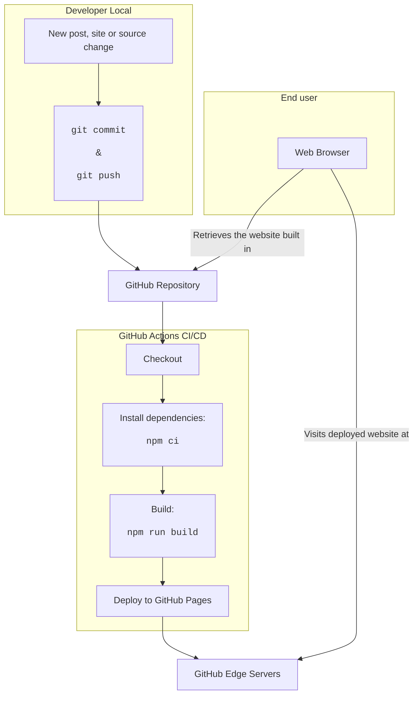

<!-- BEGIN_DOCS -->
<div align="center">

<a name="readme-top"></a>

**Tech Blog**


Nesse repositório, organizo a estrutura do meu blog pessoal 🌐

[](https://www.conventionalcommits.org/en/v1.0.0/) [](https://semantic-release.gitbook.io/semantic-release/usage/configuration) [](https://jetpack.io/devbox/docs/contributor-quickstart/)

</div>

# Sumário

- [Visão Geral](#visão-geral)
- [Estrutura de Pastas](#estrutura-de-pastas)
- [Writing](#writing)
- [Features](#features)
- [Pipeline](#pipeline)
- [Referências](#referências)
- [Versionamento](#versionamento)
- [Troubleshooting](#troubleshooting)
- [Show your support](#show-your-support)

<p align="right">(<a href="#readme-top">back to top</a>)</p>

> [!WARNING]
>
> Ainda estou desenvolvendo esse projeto, portanto, não o utilize antes da primeira release lançada.

# Visão Geral

Sempre quis ter um blog pessoal para compartilhar o que aprendo e, ao mesmo tempo, praticar minhas habilidades de escrita. Porém, sabe como é, normalmente a gente acaba adiando esse tipo de projeto por falta de tempo ou prioridade. Mas, recentemente, descobri o [Astro](https://astro.build/), um framework para construção de sites estáticos que me chamou bastante atenção. Detalhe, não sou desenvolvedor front-end, mas a proposta do Astro me pareceu bem interessante.

Como já uso o [Obsidian](https://obsidian.md/) para organizar minhas notas e ideias (em markdown), pensei que seria uma ótima oportunidade para finalmente colocar esse projeto em prática e sair da procrastinação.

Além disso, queria ter uma experiência desenvolvendo ele do zero, sem utilizar plataformas prontas como Medium, Dev.to, etc. E sim, eu sei que isso pode ser um pouco mais trabalhoso, mas acredito que o aprendizado e a experiência valerão a pena, justamente por não ser um desenvolvedor front-end e sim o cara que arruma o deploy errado de uma sexta-feira à noite ⚰️, kkkkk. Brincadeiras a parte...

E aqui estamos... Sejam muito bem-vindos ao repositório onde organizo meu Blog pessoal! 👋

<p align="right">(<a href="#readme-top">back to top</a>)</p>

# Estrutura de Pastas

## Macro

A estrutura geral de pastas do projeto é organizada da seguinte forma:

- Na raiz do projeto, você encontrará arquivos de configuração gerais de diversas ferramentas, além do arquivos essenciais para a construção e gerenciamentos dos pacotes de desenvolvimento dessa aplicação.
- Na pasta [src](src), você encontrará os arquivos de código-fonte da aplicação, cuja sua organização será detalhada mais adiante.
- Na pasta [public](public), você encontrará os arquivos estáticos da aplicação, como imagens, fontes, etc.
- Na pasta [posts](posts), você encontrará os arquivos de posts do blog, escritos em Markdown.
- Na pasta [.github](github), você encontrará mais arquivos de configuração, mas que não estão diretamente relacionados ao código-fonte da aplicação. Além disso, temos a pasta [workflows](.github/workflows) que contém os arquivos de configuração dos workflows de CI/CD.

## Micro

Detalhando agora a estrutura do projeto Astra, temos:

```
obsidian-blogger/
├── src/
│   ├── components/    # Reusable components
│   ├── content/       # Blog posts and content
│   ├── layouts/       # Page layouts
│   ├── pages/         # Route components
│   ├── styles/        # Global styles
│   └── utils/         # Utility functions
├── public/           # Static assets
├── astro.config.mjs  # Astro configuration
└── package.json      # Project dependencies
```

<p align="right">(<a href="#readme-top">back to top</a>)</p>

# Writing

Os posts estão localizados no diretório [posts](./posts) e são escritos em Markdown. Para editar ou criar um novo post, basta seguir as instruções abaixo:

- Crie um novo arquivo `.md` no diretório [posts](./posts).
- Adicione o conteúdo do post no arquivo criado.
- Adicione o frontmatter no início do arquivo. O frontmatter é um bloco de metadados que contém informações sobre o post, como título, data de publicação, autor, etc.
- Salve o arquivo e faça um commit com a mensagem no formato [Conventional Commits](https://www.conventionalcommits.org/en/v1.0.0/).
- Faça um push do commit para o repositório remoto.
- Aguarde o pipeline de CI/CD ser acionado e o site ser atualizado.

<p align="right">(<a href="#readme-top">back to top</a>)</p>

# Frontmatter

O frontmatter é um bloco de metadados que contém informações sobre o post. Ele é escrito no formato YAML e deve ser colocado no início do arquivo, antes do conteúdo do post. Nesse projeto, o frontmatter é usado da seguinte forma:

```yaml
---
title: "Título do Post"
subtitle: "Subtítulo Opcional"
description: "Descrição breve do post"
publish: true
created_date: "2024-01-01T00:00:00.000Z"
updated_date: "2024-01-01T00:00:00.000Z"
featured_image: "/caminho/para/imagem.jpg"
featured_image_alt: "Texto alternativo da imagem"
slug: "titulo-do-post"
tags:
  - "tag1"
  - "tag2"
meta_title: "Título para SEO"
meta_description: "Descrição para SEO"
canonical_url: "https://site.com/post"
og_title: "Título para Open Graph"
og_description: "Descrição para Open Graph"
og_image: "/caminho/para/og-image.jpg"
og_type: "article"
twitter_title: "Título para Twitter"
twitter_description: "Descrição para Twitter"
twitter_image: "/caminho/para/twitter-image.jpg"
twitter_card: "summary_large_image"
keywords:
  - "keyword1"
  - "keyword2"
author: "Nome do Autor"
reading_time: 10
no_index: false
---
```

| Campo | Descrição | Obrigatório? | Dicas/Formato |
| --- | --- | --- | --- |
| `title` | Título principal do post | **Sim** | Use 2-6 palavras-chave relevantes |
| `subtitle` | Subtítulo do post | Não | Mantenha curto (até 15 palavras) |
| `description` | Descrição resumida para previews | Não | Ideal entre 50-160 caracteres |
| `publish` | Se o post deve ser publicado | Não | Padrão: `true` |
| `created_date` | Data de criação do conteúdo | **Sim** | Formato ISO 8601: `"YYYY-MM-DDTHH:mm:ss.SSSZ"` |
| `updated_date` | Data da última atualização | **Sim** | Atualizar sempre que fizer modificações relevantes |
| `featured_image` | Imagem destacada do post | Não | Caminho relativo à pasta `public` (ex: `/posts/imagem.jpg`) |
| `featured_image_alt` | Texto alternativo para a imagem | Não | Descrever conteúdo e contexto da imagem |
| `slug` | URL amigável do post | Não | Gerar automaticamente do título se omitido |
| `tags` | Lista de tags para categorização | Não | Usar letras minúsculas e hífens (ex: `machine-learning`) |
| `meta_title` | Título para SEO | Não | Se omitido, usa `title` |
| `meta_description` | Descrição para SEO | Não | Se omitido, usa `description` |
| `canonical_url` | URL canônica para evitar conteúdo duplicado | Não | Usar formato absoluto (ex: `https://site.com/post`) |
| `og_title` | Título para compartilhamento no Open Graph (Facebook) | Não | Ideal até 60 caracteres |
| `og_description` | Descrição para Open Graph | Não | Ideal até 65 caracteres |
| `og_image` | Imagem para Open Graph | Não | Tamanho recomendado: 1200x630px |
| `og_type` | Tipo de conteúdo para Open Graph | Não | Padrão: `article` |
| `twitter_title` | Título para Twitter Cards | Não | Máximo 70 caracteres |
| `twitter_description` | Descrição para Twitter | Não | Máximo 200 caracteres |
| `twitter_image` | Imagem para Twitter Cards | Não | Tamanho recomendado: 1200x675px (para `summary_large_image`) |
| `twitter_card` | Tipo de card do Twitter | Não | Padrão: `summary_large_image` |
| `keywords` | Palavras-chave para SEO | Não | 5-10 termos relevantes |
| `author` | Autor do post | Não | Nome completo ou referência ao autor no sistema |
| `reading_time` | Tempo estimado de leitura em minutos | Não | Pode ser calculado automaticamente |
| `no_index` | Impede indexação por motores de busca | Não | Padrão: `false` (só habilitar para posts privados/rascunhos) |

<p align="right">(<a href="#readme-top">back to top</a>)</p>

# Features

- Dark Mode: Built-in dark mode support.
- Date-based Sorting: Chronological post organization.

<p align="right">(<a href="#readme-top">back to top</a>)</p>

# Pipeline

A forma como o projeto é construído e entregue é através de um pipeline de CI/CD utilizando o GitHub Actions. A seguir, temos um diagrama que ilustra o fluxo de trabalho desse pipeline:



Todo processo é detalhado para pensar em como as peças desse quebra-cabeça se encaixam. A ideia é que, a partir de um commit no repositório, o pipeline seja acionado e o site seja construído e entregue para o usuário final.

<p align="right">(<a href="#readme-top">back to top</a>)</p>

# Referências

Links relevantes para essa documentação:

- [Astro](https://astro.build/)
- [Obsidian](https://obsidian.md/)
- [Markdown](https://www.markdownguide.org/)
- [Jamstack Architecture](https://jamstack.org/)

<p align="right">(<a href="#readme-top">back to top</a>)</p>

# Versionamento

Para verificar o histórico de mudanças, acesse o arquivo [**CHANGELOG.md**](CHANGELOG.md).

<p align="right">(<a href="#readme-top">back to top</a>)</p>

# Troubleshooting

Se você tiver algum problema ou queria contribuir, abra uma [issue](https://github.com/lpsm-dev/tech-blog/issues/new/choose) nesse projeto.

<p align="right">(<a href="#readme-top">back to top</a>)</p>

# Show your support

<div align="center">

Dê uma ⭐️ para este projeto se ele te ajudou!


<br>
<br>

Feito com 💜 pelo **Time de DevOps** :wave: inspirado no [readme-md-generator](https://github.com/kefranabg/readme-md-generator)

</div>

<p align="right">(<a href="#readme-top">back to top</a>)</p>
<!-- END_DOCS -->
