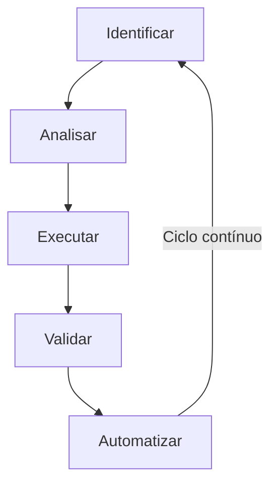

# Summary

- [Visão Geral](#Visão%20Geral)
- [Objetivo](#Objetivo)
- [Quick wins](#Quick%20wins)
  - [O que são?](##O%20que%20são?)
  - [Por que são importantes?](##Por%20que%20são%20importantes?)
  - [Características](##Características)
  - [Ciclo de Vida](##Ciclo%20de%20Vida)
- [FinOps](#FinOps)
  - [O que é?](##O%20que%20é?)
  - [Quick Wins](##Quick%20Wins)
  - [Tarefas](##Tarefas)
    - [Instances](###Instances)
    - [RDS](###RDS)
    - [S3](###S3)
    - [ECR](###ECR)
    - [Discos](###Discos)
  - [Desafios](##Desafios)
- [Conclusão](#Conclusão)

# Visão Geral

No dia a dia de quem trabalha com _AWS_, é comum nos depararmos com cenários onde precisamos agir rapidamente. Seja ao acessar a conta de um cliente para propor reduções de custo, ou ao identificar oportunidades de economia durante ações rotineiras. Mas como transformar essas oportunidades em resultados concretos de forma rápida e assertiva? A resposta está nos _quick wins_.

# Objetivo

Neste artigo, vamos explicar o que são _quick wins_ e como podemos usá-los para gerar economias na _AWS_, conectando essa ideia ao conceito de _FinOps_.

# Quick wins

## O que são?

*Quick wins* são ações rápidas e de baixo esforço que geram resultados imediatos e tangíveis, sem a necessidade de grandes investimentos ou mudanças complexas. Eles funcionam como "vitórias rápidas" que não só otimizam os gastos, mas também demonstram valor ao cliente de forma tangível e ágil.

## Por que são importantes?

1. **Agilidade**: Em um mercado competitivo, a capacidade de agir rapidamente pode fazer toda a diferença. Com uma boa lista de _quick wins_ documentados, é possível obter resultados em poucas horas ou dias.
2. **Confiança**: Apresentar soluções de forma rápida e eficaz ajuda a fortalecer a confiança do cliente, mostrando sua capacidade de gerar resultados de forma ágil e eficiente.
3. **Otimizações futuras**: Os _quick wins_ não apenas geram resultados imediatos, mas também abrem portas para análises mais profundas e ações de longo prazo, servindo como base para estratégias mais complexas.

## Características

1. **Baixo custo**: Ações simples e diretas que demandam pouco investimento ou recursos, proporcionando soluções eficazes e econômicas para problemas rápidos.
2. **Resultados rápidos**: Geram impactos tangíveis, como redução de custos ou aumento de eficiência, em um curto período de tempo, mostrando resultados imediatos.
3. **Simplicidade**: Soluções de baixa complexidade que podem ser implementadas com pouco esforço técnico e sem grandes mudanças nos processos existentes.
4. **Replicação/Escalabilidade**: Podem ser aplicadas em diferentes contextos e repetidas facilmente, permitindo consistência e eficiência a longo prazo.

## Ciclo de Vida

O ciclo de vida de um _quick win_ segue um processo estruturado com cinco etapas principais que garantem sua efetividade e continuidade:

1. **Identificação**: O primeiro passo é identificar oportunidades rápidas que podem gerar resultados imediatos com um impacto mínimo, seja em termos de recursos ou processos.
2. **Análise**: Cada oportunidade é analisada considerando o impacto potencial (seja financeiro, de tempo ou de esforço) e o grau de dificuldade para implementação. Além disso, é importante avaliar se o benefício justifica o esforço necessário e se a mudança será sustentável a longo prazo.
3. **Execução**: Nesta fase, as ações planejadas são implementadas. Isso pode incluir mudanças simples ou ajustes rápidos nos processos ou na alocação de recursos para atingir os resultados desejados.
4. **Validação**: Após a execução, é hora de verificar se os resultados estão de acordo com o esperado. A validação inclui medir o impacto direto da mudança e confirmar que não houve efeitos negativos imprevistos.
5. **Automatização**: Quando um _quick win_ se revela eficiente, a próxima etapa é torná-lo repetível e contínuo, sempre que possível. A automação pode garantir que os mesmos resultados sejam alcançados de forma regular, sem necessidade de intervenção manual.

Ao estruturar os _quick wins_ dentro desse ciclo de vida, é possível garantir uma estratégia contínua de melhoria e otimização. Cada etapa do ciclo não apenas contribui para a obtenção de resultados rápidos, mas também cria uma base para ajustes e aperfeiçoamentos constantes.

# FinOps

## O que é?

A **prática de FinOps** se refere à colaboração entre equipes de finanças, operações e desenvolvimento com o objetivo de otimizar o uso dos recursos financeiros de uma empresa para implantar um produto em uma infraestrutura específica. Ela busca promover uma colaboração eficiente entre essas áreas para que as decisões sobre custos sejam tomadas de forma ágil, informada e alinhada com as metas do negócio. A ideia central do FinOps é garantir que os recursos sejam usados de forma inteligente e que os gastos sejam monitorados e controlados continuamente.

## Quick Wins

Incorporando _quick wins_ como parte do ciclo de vida de FinOps, as empresas podem reduzir custos de forma eficiente enquanto desenvolvem uma cultura de otimização financeira contínua.

## Tarefas

Aqui estão alguns exemplos de *quick wins* que podem ser implementados rapidamente para otimizar custos na _AWS_:

### Instances

- Alterar tipo de instância EC2

### RDS

- Redimensionar instância RDS

### S3

- Configuração de políticas de ciclo de Vida S3

### ECR

- Configuração de políticas de ciclo de vida ECR

### Discos

- Mudar tipo de volume EBS (por exemplo, de gp2 para gp3)
- Excluir volumes EBS não utilizados

## Desafios

A implementação de automações para _quick wins_ de _FinOps_ na _AWS_ pode enfrentar diversas barreiras técnicas. A integração de sistemas para coletar dados financeiros em tempo real é um desafio, especialmente ao conectar ferramentas como AWS Cost Explorer e CloudWatch. A configuração de permissões adequadas no IAM também é crucial, pois muitas automações requerem permissões específicas para modificar recursos, como instâncias EC2 e volumes EBS.

Além disso, a automação precisa lidar com exceções e erros, garantindo que os processos não interrompam serviços críticos, e deve ser monitorada de perto para garantir que o impacto nos custos seja positivo. A personalização das automações para diferentes ambientes e clientes também pode aumentar a complexidade, assim como a necessidade de gerenciar o custo da própria automação, como o uso de funções Lambda ou Step Functions.

Superar essas barreiras técnicas requer uma combinação de boas práticas de desenvolvimento, monitoramento contínuo e uma arquitetura escalável que permita otimizar os custos de forma eficiente e sustentável na _AWS_.

# Conclusão

A ideia de *quick wins* não se restringe somente a _FinOps_. Ela pode ser aplicada em diversas áreas de conhecimento, como segurança, desempenho, confiabilidade, operações e etc.

No contexto de _FinOps_, elas têm o poder de gerar resultados financeiros imediatos, estabelecendo uma cultura de eficiência e otimização.

Ao aplicar esse conceito, as empresas não apenas conseguem otimizar os custos, mas também garantem que os recursos sejam usados de forma inteligente e eficaz, criando uma infraestrutura financeira resiliente e alinhada com os objetivos do negócio.
